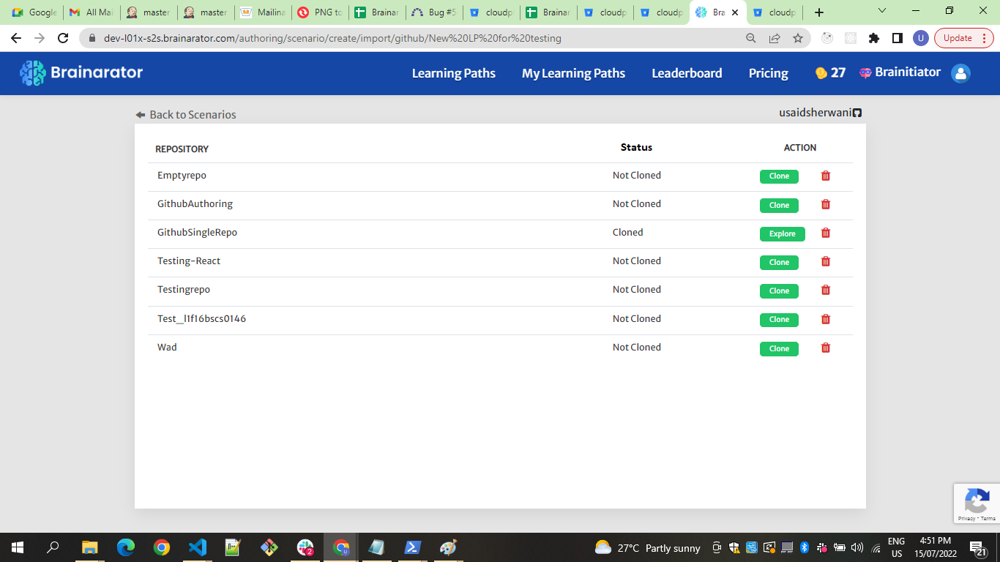

<!--Introduction to microservices and service mesh-->

Microservice means splitting the whole application into independent workable pieces that communicates with each other via networks. Each unit serves some business logic and all units combined work as an application. This approach is also called `service-oriented` architecture where specific use case-based divisions are done.

But the problem doesn't end at just implementing microservices. Having more layers of the application makes it a bit difficult to maintain. Nowadays, a common practice is to implement the setup over containers, and adding more and more containers makes management a challenging task.

Kubernetes makes the management of containers simple but doesn't have all the tools to manage security and inter-services communication. 

Service mesh is a technology responsible for managing the network communication services.

Service mesh is an independent dedicated infrastructure layer for securely managing and observing network communication between the micro-units of an application. Istio is one of these tools that work on K8s.

Let's jump on the hands-on part.

